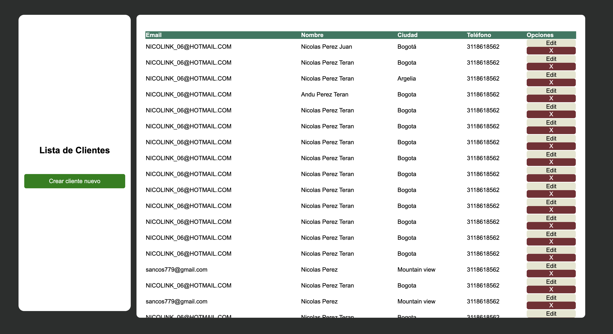
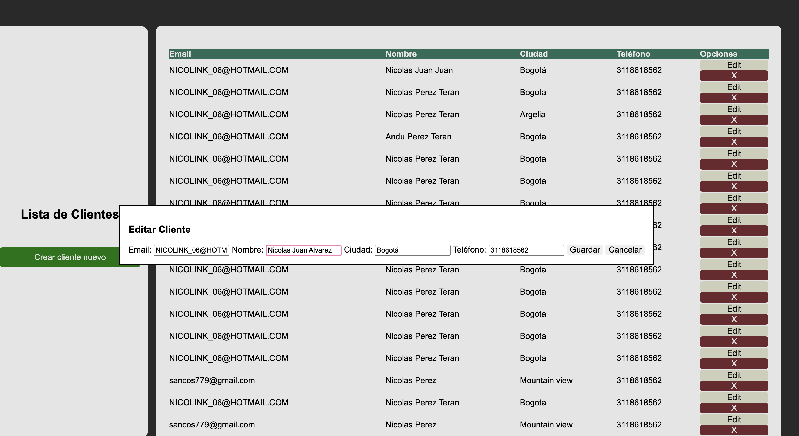
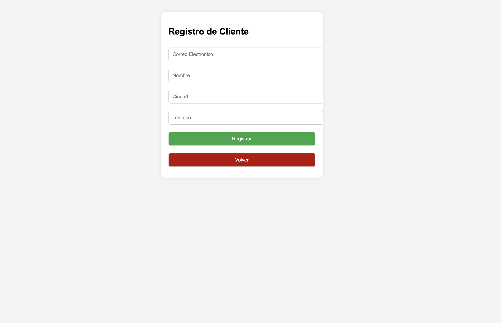

# Ejecución.

Se requiere tener una DB MySQL, y crear la DB mediante el codigo incluido en la carpeta Includes.

Una vez creada la DB, ingresar a la carpeta API.REST.PHP y correr el siguiente comando.

php -S localhost:8000

Y posteriormente dirigirse a:

http://localhost:8000/views/index.php

# Cambios realizados.

Se añadió la carpeta views con dos archivos.

## index.php: 

Archivo con la interfaz principal de la aplicación, en esta se realizan los llamados GET (Todos los usuarios), PUT (Actualizacion de usuarios) y DELETE (Para la eliminación de usuarios) al API REST por medio de Fetch..

Se creo una tabla que muestre la informacion de los clientes, y se añadio un campo de opciones donde estará la opcion de editar o eliminar un usuario.

## Create-client.php.

Interfaz grafica para la creación de clientes. Posee el boton para registrar clientes y el boton para volver a la pagina principal.

# Ejercicios PHP
 - Crea un ejercicio de API REST en php y pon en práctica un proceso básico de autentificación con PHP y MySQL sin usar ningún framework ni librería.
 - Tener en cuenta el uso de POST, PUT, DELETE y GET.
 - Montar CRUD en plantilla básica de HTML y aplicar estilos (CSS)
 - Documentar
